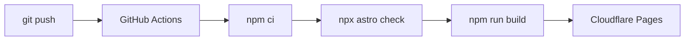

# 🌐 raddah.net

> مدونة شخصية ثلاثية اللغات (عربي / إنجليزي / صيني) مبنية بـ [Astro](https://astro.build) وتُستضاف على [Cloudflare Pages](https://pages.cloudflare.com).

[](https://astro.build)
[](https://typescriptlang.org)
[](https://pages.cloudflare.com)
[](LICENSE)

---

## 📑 الفهرس

- [١. مقدمة](#١-مقدمة)
- [٢. هيكل المشروع](#٢-هيكل-المشروع)
- [٣. إنشاء مقالة جديدة](#٣-إنشاء-مقالة-جديدة)
- [٤. الترجمة للثلاث لغات](#٤-الترجمة-للثلاث-لغات)
- [٥. من المسودة إلى النشر](#٥-من-المسودة-إلى-النشر)
- [٦. رفع التحديثات على GitHub](#٦-رفع-التحديثات-على-github)
- [٧. الربط مع Cloudflare](#٧-الربط-مع-cloudflare)
- [٨. المميزات المستخدمة](#٨-المميزات-المستخدمة)
- [٩. مميزات لم تُستخدم](#٩-مميزات-لم-تُستخدم)
- [١٠. حل المشكلات الشائعة](#١٠-حل-المشكلات-الشائعة)
- [١١. قائمة التحقق السريعة](#١١-قائمة-التحقق-السريعة)

---

## ١. مقدمة

هذا الموقع مدونة شخصية ثلاثية اللغات مبنية بإطار **Astro** وتُستضاف على **Cloudflare Pages**.

> **ملاحظة:** الموقع يستخدم نظام "Content Collections" في Astro، مما يعني أن كل مقالة هي ملف Markdown/MDX منفصل مع بيانات Frontmatter (عنوان، وصف، تاريخ، تصنيف... إلخ).

### اللغات المدعومة

| اللغة | الرمز | الاتجاه |
|:---:|:---:|:---:|
| 🇸🇦 العربية | `ar` | RTL |
| 🇬🇧 الإنجليزية | `en` | LTR |
| 🇨🇳 الصينية | `zh` | LTR |

---

## ٢. هيكل المشروع

```
raddah.net/
├── 📁 src/
│   ├── 📁 content/blog/          ← مقالات المدونة
│   │   ├── 📁 ar/                ← النسخة العربية
│   │   ├── 📁 en/                ← النسخة الإنجليزية
│   │   └── 📁 zh/                ← النسخة الصينية
│   ├── 📁 pages/                 ← صفحات Astro
│   │   ├── 📁 ar/ | 📁 en/ | 📁 zh/
│   ├── 📁 i18n/                  ← الترجمة والإعدادات
│   ├── 📁 components/            ← المكونات
│   │   ├── 📁 blog/              ← مكونات المدونة
│   │   ├── 📁 global/            ← مكونات عامة (Header, Footer)
│   │   ├── 📁 project/           ← مكونات المشاريع
│   │   └── 📁 ui/                ← مكونات واجهة المستخدم
│   ├── 📁 layouts/               ← قوالب الصفحات
│   ├── 📁 styles/                ← CSS المخصص
│   └── 📁 utils/                 ← دوال مساعدة
├── 📁 public/                     ← الصور والملفات الثابتة
│   ├── 📁 images/blog/           ← صور المقالات
│   ├── 📁 images/projects/       ← صور المشاريع
│   └── 📁 og/                    ← صور Open Graph
├── 📁 scripts/
│   └── new-post.ts               ← سكريبت إنشاء المقالات
├── 📄 astro.config.mjs           ← إعدادات Astro
├── 📄 .github/workflows/         ← GitHub Actions (النشر التلقائي)
└── 📄 package.json
```

---

## ٣. إنشاء مقالة جديدة

### الطريقة الأولى: السكريبت التلقائي (موصى بها)

```bash
npm run new:post
```

**الخطوات:**

1. **اختيار اللغة** — ستظهر قائمة بثلاث خيارات:
   - 🇸🇦 العربية (ar)
   - 🇬🇧 English (en)
   - 🇨🇳 中文 (zh)

2. **إدخال البيانات** — أدخل العنوان، الوصف القصير، التصنيف، والوسوم (مفصولة بفواصل). إذا كانت اللغة عربية، سيُطلب منك إدخال `slug` بالإنجليزية.

3. **التحقق من الإنشاء** — سيتم إنشاء ملف Markdown في المسار الصحيح:
   ```
   src/content/blog/ar/my-new-post.md
   ```

### الطريقة الثانية: يدويًا

أنشئ ملف `.md` داخل `src/content/blog/XX/` حيث XX هي رمز اللغة.

**مثال على Frontmatter:**

```yaml
---
title: "عنوان المقالة"
description: "وصف قصير للمقالة"
publishDate: 2026-05-09
author: "Raddah"
category: "تقنية"
tags: ["astro", "مدونة"]
featured: false
draft: true
translations:
  en: "english-slug"
  zh: "chinese-slug"
heroImage: "/images/blog/my-image.jpg"
heroImageAlt: "وصف الصورة"
---

اكتب المحتوى هنا بصيغة Markdown...
```

> 💡 **تلميح:** اترك `draft: true` أثناء الكتابة، وغيّره إلى `false` عندما تصبح جاهزًا للنشر.

---

## ٤. الترجمة للثلاث لغات

### ربط الترجمات ببعضها

في الـ Frontmatter، استخدم حقل `translations` لربط النسخ المختلفة:

```yaml
---
title: "عنوان المقالة العربي"
translations:
  en: "english-slug"
  zh: "chinese-slug"
---
```

### الترجمة النصية للواجهة

كل النصوص الثابتة (القائمة، الأزرار، التذييل...) توجد في:

```
src/i18n/ui.ts
```

عند إضافة نص جديد، يجب إضافته للثلاث لغات:

```typescript
// العربية
'nav.newItem': 'عنصر جديد',

// English
'nav.newItem': 'New Item',

// 中文
'nav.newItem': '新项目',
```

> ⚠️ **تنبيه:** إذا أضفت نصًا جديدًا في `ui.ts` ولم تترجمه لإحدى اللغات، سيظهر بشكل غير صحيح في تلك النسخة.

---

## ٥. من المسودة إلى النشر

### خطوات النشر

| الخطوة | الأمر | الوصف |
|:---:|:---|:---|
| 1 | `npm run dev` | تشغيل خادم التطوير |
| 2 | `npm run check` | فحص الأنواع (TypeScript) |
| 3 | `npm run build` | بناء الموقع |
| 4 | — | تغيير `draft: true` إلى `draft: false` |

### معاينة محلية

```bash
npm run dev
```

ثم افتح: [http://localhost:4321](http://localhost:4321)

### بناء الموقع

```bash
npm run build
```

> ✅ تأكد أن البناء ينجح بدون أخطاء قبل الرفع.

---

## ٦. رفع التحديثات على GitHub

```bash
# 1. مراجعة التغييرات
git status

# 2. إضافة الملفات
git add src/content/blog/ar/my-post.md
# أو أضف كل شيء:
git add .

# 3. إنشاء Commit
git commit -m "إضافة مقالة: عنوان المقالة"

# 4. الرفع إلى GitHub
git push origin main
```

> 💡 **نصيحة:** اجعل رسالة Commit واضحة ووصفية، مثل: `add: agi-era post (ar/en/zh)`.

---

## ٧. الربط مع Cloudflare

عند كل `git push` على فرع `main`، يعمل GitHub Action تلقائيًا لبناء الموقع ونشره على Cloudflare Pages.

### كيف يعمل؟



### الإعدادات المطلوبة في GitHub

في إعدادات المستودع (**Settings → Secrets and variables → Actions**) يجب إضافة:

| المتغير | الوصف |
|:---|:---|
| `CLOUDFLARE_API_TOKEN` | مفتاح API من Cloudflare (صلاحيات: Cloudflare Pages:Edit) |
| `CLOUDFLARE_ACCOUNT_ID` | معرف حساب Cloudflare |

> 💡 **تلميح:** يمكنك مراقبة حالة البناء من تبويب **Actions** في مستودع GitHub.

---

## ٨. المميزات المستخدمة

### المحتوى

| الميزة | الحالة |
|:---|:---:|
| Content Collections مع تحقق Zod | ✅ |
| i18n Routing (ar/en/zh) | ✅ |
| MDX لدعم المكونات داخل المقالات | ✅ |
| RSS Feed لكل لغة | ✅ |
| Sitemap دولي | ✅ |

### الأداء والتصميم

| الميزة | الحالة |
|:---|:---:|
| صور محسّنة عبر Sharp | ✅ |
| Shiki + rehype-pretty-code (أكواد ملونة) | ✅ |
| Pagefind (بحث فوري) | ✅ |
| CSS مخصص مع متغيرات التصميم | ✅ |
| IntersectionObserver لجدول المحتويات | ✅ |

### الأتمتة

| الميزة | الحالة |
|:---|:---:|
| GitHub Actions للنشر التلقائي | ✅ |
| سكريبت CLI لإنشاء المقالات | ✅ |
| Prettier لتنسيق الكود | ✅ |
| TypeScript strict | ✅ |

### UX / واجهة المستخدم

| الميزة | الحالة |
|:---|:---:|
| تبديل الوضع الفاتح/الداكن | ✅ |
| مؤشر تقدم القراءة | ✅ |
| أزرار المشاركة (X / LinkedIn / نسخ) | ✅ |
| مقالات ذات صلة | ✅ |
| تخطيط RTL/LTR حسب اللغة | ✅ |
| صور مصغرة لجميع المقالات | ✅ |
| صفحات أرشيف | ✅ |
| صفحات بحث مستقلة | ✅ |

---

## ٩. مميزات لم تُستخدم

هذه ميزات متاحة في Astro لكن المشروع الحالي لا يستخدمها — يمكنك إضافتها مستقبلًا:

| الميزة | السبب / البديل الحالي |
|:---|:---|
| Server Islands | الموقع static بالكامل |
| View Transitions API | التنقل الحالي تقليدي وسريع |
| Astro DB | لا توجد بيانات ديناميكية |
| Content Layer (الجديد) | يُستخدم `glob loader` التقليدي |
| React / Vue / Svelte | كل المكونات Astro纯 (zero JS) |
| Edge Middleware | لا حاجة لتحويلات على الطلبات |
| Partytown | لا توجد سكريبتات طرف ثالث ثقيلة |

---

## ١٠. حل المشكلات الشائعة

### ❌ البناء يفشل مع "Type error"

```bash
npm run check
```

اقرأ رسالة الخطأ وصحّح نوع البيانات في Frontmatter. غالبًا يكون سببه:

- تاريخ غير صالح في `publishDate`
- حقل مفقود (مثل `category`)

### ❌ المقالة لا تظهر في الموقع

- تأكد أن `draft: false`
- تأكد أن الملف في المجلد الصحيح: `src/content/blog/XX/`
- تأكد من صحة الامتداد `.md` أو `.mdx`

### ❌ الترجمة لا تظهر في Language Switcher

- تأكد من ربط `translations` في Frontmatter
- تأكد أن slug اللغة الأخرى مطابق لاسم الملف

### ❌ Pagefind (البحث) لا يعمل محليًا

البحث يحتاج بناءً أولًا لإنشاء الفهرس:

```bash
npm run build
npm run preview
```

### ❌ GitHub Action فشل في النشر

- تحقق من صحة `CLOUDFLARE_API_TOKEN` وصلاحياته
- تأكد أن `CLOUDFLARE_ACCOUNT_ID` صحيح
- راجع سجلّ Actions في GitHub للتفاصيل

---

## ١١. قائمة التحقق السريعة

قبل كل نشر، راجع هذه القائمة:

- [ ] المقالة مكتوبة بصيغة Markdown/MDX صحيحة
- [ ] Frontmatter كامل (title, description, publishDate, category)
- [ ] `draft: false` للمقالات الجاهزة
- [ ] الترجمة موجودة لكل اللغات المطلوبة
- [ ] الصور موجودة في مجلد `public/images/blog/`
- [ ] `npm run check` — لا أخطاء
- [ ] `npm run build` — نجاح
- [ ] `git commit` واضح ووصفي
- [ ] `git push origin main`
- [ ] التحقق من تبويب Actions في GitHub
- [ ] فتح raddah.net والتأكد من ظهور المحتوى

> 💡 **بعد النشر:** تحقق من العنوان على وسائل التواصل (Open Graph) باستخدام [opengraph.xyz](https://www.opengraph.xyz).

---

## 🛠️ المتطلبات

- [Node.js](https://nodejs.org) 18+
- [npm](https://npmjs.com) 9+

## 🚀 البدء السريع

```bash
# استنساخ المستودع
git clone https://github.com/raddah/raddah.net.git

# الدخول للمجلد
cd raddah.net

# تثبيت الاعتماديات
npm install

# تشغيل خادم التطوير
npm run dev
```

---

## 📄 الترخيص

هذا المشروع مرخص بموجب [MIT License](LICENSE).

---

<div align="center">

**[raddah.net](https://raddah.net)** | مبني بـ 💜 و [Astro](https://astro.build)

</div>
